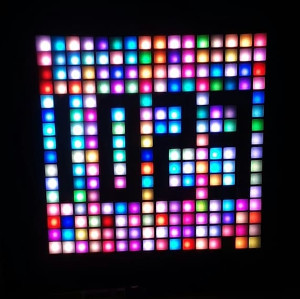
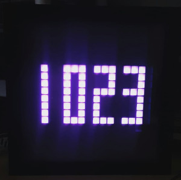

# Basic Clock

-------------------------

## Overview
A basic digital clock display that also plays the Westminster Quarters to mark each quarter-hour.

-------------------------

## Installation Instruction

1. The Basic Clock app makes a request to a server to get the current local time. Make sure you have the ``.boot0`` and ``.boot1`` files in your Espruino storage.
2. Copy the code from ./app.js into the Espruino IDE.
3. Update the TZ and color variables at the top of the script with your values.
4. Flash the code on to your device.