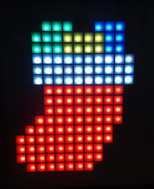

# Stocking

## Image Tilemap

[
        [7,7,7,7,7,7,7,7,7,7,7,7,7,7,7,7],
        [7,7,7,7,6,6,6,7,7,5,5,5,7,7,7,7],
        [7,7,7,6,6,6,4,4,4,4,5,5,7,7,7,7],
        [7,7,7,6,6,6,4,4,4,4,5,5,7,7,7,7],
        [7,7,7,1,1,1,1,2,2,1,1,1,2,7,7,7],
        [7,7,7,2,1,1,2,1,1,2,1,2,1,7,7,7],
        [7,7,7,1,2,2,1,1,1,1,2,1,1,7,7,7],
        [7,7,7,7,3,3,3,3,3,3,3,3,7,7,7,7],
        [7,7,7,7,3,3,3,3,3,3,3,3,7,7,7,7],
        [0,0,0,0,3,3,3,3,3,3,3,3,0,0,0,0],
        [0,0,0,3,3,3,3,3,3,3,3,3,0,0,0,0],
        [0,0,3,3,3,3,3,3,3,3,3,0,0,0,0,0],
        [0,3,3,3,3,3,3,3,3,3,3,0,0,0,0,0],
        [0,3,3,3,3,3,3,3,3,3,0,0,0,0,0,0],
        [0,3,3,3,3,3,3,3,3,3,0,0,0,0,0,0],
        [0,0,3,3,3,3,3,3,3,0,0,0,0,0,0,0]
    ]
    
## Color Array

["000","333","222","050","220","113","311","000"]

