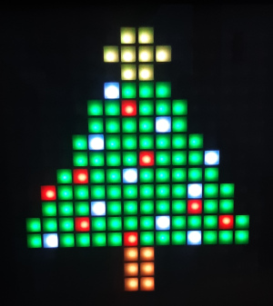

# Gallery

-------------------------

## Overview

The gallery app displays carousel of tilemapped pixel art images. Rotating images every 10 seconds.

You can select the images you want from the image-tilemaps folder or create your own. 

-------------------------

## Installation Instruction

1. Update the `images` and `colors` arrays with the values you want.
2. Flash the code in ``app.js`` on to your Espruino.